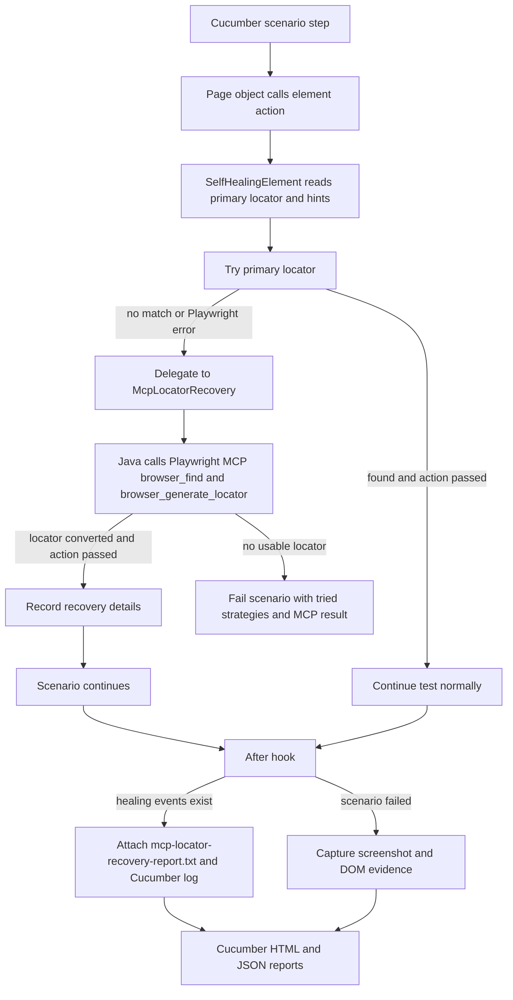
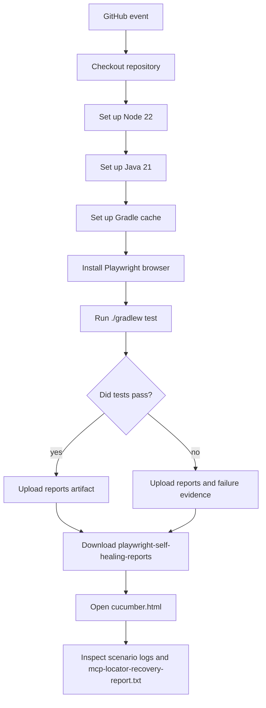

# playwright-mcp-usage

Java + Gradle + Cucumber + Playwright demo automation framework using the
page-object pattern, primary locators, MCP-based locator recovery, and the
official Playwright MCP server for runtime locator healing.

## Demo Application

The included scenarios use the public Practice Test Automation login page:

`https://practicetestautomation.com/practice-test-login/`

Credentials used by the smoke scenario:

- Username: `student`
- Password: `Password123`

## Framework Layout

- `src/test/resources/features` - Cucumber feature files
- `src/test/java/com/example/playwright/steps` - Cucumber hooks and step definitions
- `src/test/java/com/example/playwright/pages` - page objects only; all web elements live here
- `src/test/java/com/example/playwright/healing` - MCP-based locator recovery, Playwright MCP client, locator conversion, and healing report support
- `src/test/java/com/example/playwright/core` - Playwright driver lifecycle and evidence capture
- `src/test/java/com/example/playwright/config` - runtime configuration
- `.github/workflows/playwright-self-healing-tests.yml` - GitHub Actions pipeline

## Self-Healing Approach

Each page object element is defined as an `ElementDefinition` with one primary
locator and optional intent hints. If the primary locator fails, the framework
delegates the failure to `McpLocatorRecovery`. This Java component starts the official
Playwright MCP server with `npx @playwright/mcp@latest`, asks MCP to find the
target element, asks `browser_generate_locator` for a stable locator, converts
that locator to Playwright Java, and returns a healing decision for retry.

Example from `LoginPage`:

```java
private static final ElementDefinition SUBMIT = new ElementDefinition(
        "login submit button",
        new LocatorStrategy("button#submit", page -> page.locator("button#submit")),
        "Submit"
);
```

If `button#submit` stops matching but the submit button is still recognizable on
the page, Playwright MCP can generate `getByRole('button', { name: 'Submit' })`,
and the Java test retries the click with `page.getByRole(...)`. Page objects do
not define secondary selectors.

## Flow Diagrams

- Current MCP-based locator recovery flow: [playwright-mcp-locator-recovery-flow.svg](playwright-mcp-locator-recovery-flow.svg)
- Previous direct-MCP flow: [playwright-mcp-direct-healing-flow.svg](playwright-mcp-direct-healing-flow.svg)



## What Gets Reported

When a Playwright MCP selector succeeds, the Cucumber report includes the healing
details on the scenario where the healing happened.

The framework writes the details in two places:

- A visible Cucumber log entry in `cucumber.html`
- A `mcp-locator-recovery-report.txt` scenario attachment

Example report content:

```text
MCP-based locator recovery events

Event 1
Element: login submit button
Recovered by: MCP-based locator recovery using Playwright MCP getByRole('button', { name: 'Submit' }) target=e42
Skipped strategies:
- button#submit (no matches)
Recovery details:
The recovery component used Playwright MCP browser_find to identify the element reference,
then browser_generate_locator to create a stable Playwright locator.
```

If multiple scenarios use the same healed element, each affected scenario gets
its own report attachment. Scenarios with no healing do not get a
`mcp-locator-recovery-report.txt` attachment.

## MCP-Based Locator Recovery

The healing path uses the official Playwright MCP server over Streamable HTTP:

```text
Java test -> failed primary locator -> McpLocatorRecovery -> Playwright MCP -> locator conversion -> Java retry
```

Recovery is managed by `McpLocatorRecovery`:

- The recovery component receives the logical element name, intent hints, current page URL,
  and failed primary locator.
- The recovery component uses Playwright MCP `browser_find` to identify the target element in
  the accessibility snapshot.
- The recovery component uses Playwright MCP `browser_generate_locator` to generate a stable
  locator expression.
- The recovery component checks that the locator can be converted to Playwright Java.
- `SelfHealingElement` retries the original action with the MCP-generated
  locator.

If MCP cannot find a matching element or returns a locator expression that this
Java framework cannot convert, the scenario fails with the tried primary locator
and MCP context.

## MCP With and Without an AI Agent

Playwright MCP can be used without an agent:

```text
Locator fails -> Java calls Playwright MCP -> MCP generates locator -> Java retries action
```

That is enough when the element is still recognizable through normal browser
signals such as role, accessible name, label, placeholder, text, id, or nearby
snapshot context.

This branch uses Java orchestration with a predefined sequence of MCP calls.
It does not invoke an LLM, require model credentials, or use an IDE agent.
The report's recovery details describe those programmed steps, not model reasoning.

An LLM-powered agent would add a model-driven investigation and tool-selection
loop. It could propose code repairs and rerun tests, but that capability is not
implemented here. An IDE agent would run locally; GitHub Actions would need its
own compatible agent runtime and model authentication. MCP JSON configuration
alone does not provide an agent.

Current limitations: recovery does not classify application defects, score
confidence, disambiguate all matching elements, or update source code. The retry
uses the first matching locator. MCP opens the same URL in a separate browser;
the test browser's session and interaction state are not automatically copied.
Passing a retry is not proof that the intended element was selected, so scenario
assertions and review of recovery reports remain necessary.

## Local Usage

Install browser binaries once:

```bash
./gradlew installPlaywrightBrowsers
```

Run the Cucumber tests:

```bash
./gradlew test
```

Useful runtime options:

```bash
HEADLESS=false ./gradlew test
BASE_URL=https://practicetestautomation.com ./gradlew test
./gradlew test -Dcucumber.filter.tags="@smoke"
```

Reports are written to:

- `build/reports/tests/test/index.html`
- `build/reports/cucumber/cucumber.html`
- `build/reports/cucumber/cucumber.json`

Failure evidence is written to:

- `build/evidence`

## Local Demo: Force a Healing Event

This branch already contains an intentionally invalid submit locator in
`LoginPage` to exercise recovery:

```java
new LocatorStrategy("button#submit-broken-for-healing-demo",
        page -> page.locator("button#submit-broken-for-healing-demo")),
```

Run:

```bash
./gradlew test
```

Expected behavior:

- The first submit locator has no matches.
- The framework uses a generated `MCP-based locator recovery using Playwright MCP ...` locator.
- The scenario passes.
- `cucumber.html` shows `MCP-based locator recovery events`.
- The scenario has a `mcp-locator-recovery-report.txt` attachment.

Restore the primary locator to `button#submit` when you no longer need the
forced-recovery demo. The framework does not persist generated locators to source.

## GitHub Actions Pipeline

The workflow is defined at:

`.github/workflows/playwright-self-healing-tests.yml`

It runs on:

- push to `main` or `master`
- pull requests
- manual `workflow_dispatch`

Pipeline flow:



The workflow uploads this artifact:

`playwright-self-healing-reports`

Artifact contents:

- `build/reports/cucumber/cucumber.html`
- `build/reports/cucumber/cucumber.json`
- `build/reports/tests/test`
- `build/evidence`

The Playwright MCP healing report does not require an AI API key. The framework
starts the official MCP server through `npx` during the test run. The workflow
sets up Node 22 for `npx` and uses `PW_TIMEOUT_MS=30000` to reduce external page
load flakiness in CI.

## How We Achieved Self-Healing in This Framework

1. Page objects define logical elements with one primary locator and intent
   hints.
2. `SelfHealingElement` tries the primary locator for every action.
3. When the primary locator has no matches or throws a Playwright error, it is recorded
   as skipped.
4. `McpLocatorRecovery` calls the official Playwright MCP server and requests a
   generated locator with `browser_generate_locator`.
5. When the MCP-generated locator works, `HealingReport.recordMcpRecovery(...)` stores
   the element name, healed strategy, and skipped strategies for the current
   thread.
6. The Cucumber `@After` hook checks whether the current scenario has healing
   events.
7. If healing happened, the hook writes a visible scenario log and attaches
   `mcp-locator-recovery-report.txt`.
8. If MCP does not produce a usable locator, the scenario fails with the primary
   locator and MCP context.
9. Locally and in GitHub Actions, the same Gradle test command generates the
   Cucumber HTML/JSON reports.

## What Should Be Auto-Healed and What Should Not

Self-healing is useful for:

- button text changed slightly
- ID changed
- CSS class changed
- DOM hierarchy changed
- placeholder changed
- label changed slightly
- element moved to another container

Self-healing should not blindly fix:

- business flow changed
- wrong page loaded
- security or permission issue
- element removed intentionally
- validation message changed due to requirement change
- payment, finance, or legal workflow behavior changed

For example, if a "Submit Payment" button disappears, the framework should not
randomly click another button. That could hide a real defect.

## Interview Notes

This framework demonstrates a valid modern self-healing approach, but it is not
the only way teams build self-healing automation.

A concise way to explain this project:

```text
Page objects keep only a primary locator and intent hints. When a locator fails,
Java MCP-based locator recovery uses Playwright MCP to inspect the page accessibility
snapshot, generate a stable Playwright locator, validate it, retry the original
action, and attach a detailed healing report.
```

Common self-healing approaches in test automation:

- Deterministic fallback locators: try ordered locators such as id, name, role,
  text, and XPath.
- DOM similarity scoring: compare the old element attributes, text, tag,
  classes, and position with the current DOM.
- Accessibility-first repair: prefer stable Playwright locators such as
  `getByRole`, `getByLabel`, `getByPlaceholder`, `getByText`, and `getByTestId`.
- AI-assisted healing: use the failed locator, logical element name, test step,
  page URL, error, and page snapshot to choose a better locator.
- MCP-assisted agent workflow: let an agent use Playwright MCP tools such as
  `browser_find` and `browser_generate_locator` to inspect browser state and
  generate a locator.

The important interview points are:

- Start with stable locators before relying on healing.
- Heal only locator drift, not real product or business-flow failures.
- Validate any generated locator before retrying the action.
- Record every healing event in the test report.
- Fail when no usable locator is returned; confidence scoring is not implemented here.
- Consider updating the page object later so the same locator is not healed on
  every run.

Useful interview wording:

```text
I designed a self-healing layer where page objects keep a primary locator and
intent hints. On locator failure, Java MCP-based locator recovery uses Playwright MCP to
inspect the accessibility snapshot, generate a stable Playwright locator,
convert it to Java, retry the action, and attach a recovery report. This branch
does not use an LLM-powered agent. Assertions remain necessary because a matching
locator alone does not establish that a repair is semantically correct.
```

Runtime healing keeps CI moving, but permanent repair should usually be tracked
through reports or a follow-up pull request that updates the broken primary
locator after review.
