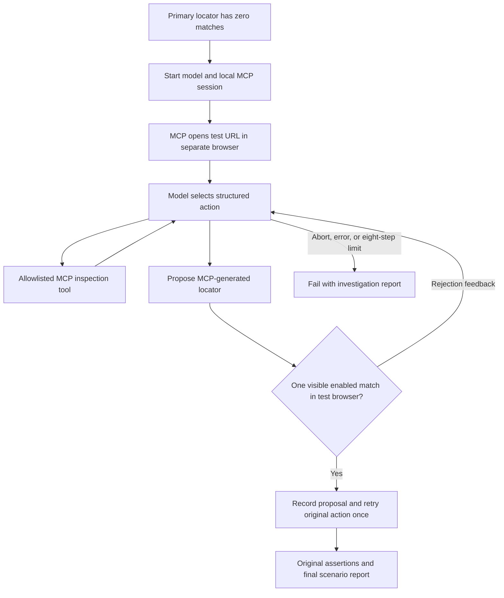

# Playwright MCP With an LLM Healing Agent

Java 21, Gradle, Cucumber, Playwright, and an actual model-driven locator repair
loop. This branch uses the OpenAI Responses API to investigate missing locators
with Playwright MCP. The model chooses inspection steps, receives observations,
proposes generated locators, and can revise rejected candidates or decline repair.

## Framework Layout

Java methods, constructors, and functional-interface operations have JavaDoc
immediately above their declarations (before annotations where present). These
comments explain purpose, key actions, and relevant failure or cleanup behavior.
Test-method comments explain what each verification checks.

- `healing/LlmHealingAgent.java`: bounded model/tool/validation loop.
- `healing/OpenAiRepairModel.java`: provider authentication and structured responses.
- `healing/PlaywrightMcpClient.java`: local official MCP server transport.
- `healing/SelfHealingElement.java`: primary locator and one repaired action attempt.
- `healing/HealingReport.java`: investigation summaries and validation outcomes.

These files live under `src/test/java/com/example/playwright`. Page objects in
`pages` keep primary locators and intent hints; `steps` contains Cucumber hooks
and assertions; `src/test/resources/features` defines the scenarios.
CI uses `.github/workflows/playwright-llm-agent-tests.yml`.

## Flow Diagrams

- Current: [LLM agent repair](playwright-mcp-llm-agent-flow.svg).
- Current deployment: [LLM agent locally and in GitHub Actions](playwright-mcp-llm-local-ci-flow.svg).
- Historical: [MCP recovery without an LLM](playwright-mcp-locator-recovery-flow.svg).
- Earlier historical flow: [direct MCP recovery](playwright-mcp-direct-healing-flow.svg).

All diagrams are next to this README. Historical diagrams describe previous
implementations without a model; they are not the execution path in this branch.
The current diagrams distinguish model decisions, Java validation, MCP browser
tools, and credential-free verification from authenticated live runs.



The model chooses `snapshot`, `find`, `generate`, `propose`, or `abort`.
Java maps inspection actions to `browser_snapshot`, `browser_find`, and
`browser_generate_locator`. Only expressions previously returned by MCP can be
accepted. Validation failures become observations for the next model turn.

## Local Usage and Authentication

Install Java 21, Node.js with `npx`, and browser binaries. Configure
`OPENAI_API_KEY` securely in your terminal or IDE environment and set
`OPENAI_MODEL` to an accessible Responses API model supporting structured outputs.
Both are required; there is no default model or deterministic fallback.
Do not commit keys or pass them as Gradle command-line properties.
Ignored `.env` files are not automatically loaded. OpenAI is the supported provider.

```bash
./gradlew installPlaywrightBrowsers
./gradlew clean build -DPW_TIMEOUT_MS=30000
```

Credential-free verification:

```bash
./gradlew clean agentTest
```

Real local browser and MCP verification with scripted model decisions:

```bash
./gradlew agentBrowserTest
```

This checks an actual MCP-generated locator against a local fixture, executes the
repaired click, and rejects duplicate, hidden, and disabled matches. It needs
browser binaries and `npx`, but no model credentials. Its report is
`build/reports/tests/agentBrowserTest/index.html`.

`agentTest` uses controlled model responses and a local mock provider HTTP server.
It tests the loop and API contract, not real-model repair quality. Full `build`
runs the Cucumber scenarios and requires credentials for recovery.

The demo uses `https://practicetestautomation.com/practice-test-login/`, username
`student`, and password `Password123`. `LoginPage` intentionally contains
`button#submit-broken-for-healing-demo` to trigger repair in both scenarios.
Restore `button#submit` when the forced-repair demo is no longer needed.
Other options remain `HEADLESS=false`, `BASE_URL`, and `-Dcucumber.filter.tags`.

## Reports

### Verification Status

The real LLM integration is implemented in `OpenAiRepairModel` and
`LlmHealingAgent`, but a live OpenAI-backed repair has not yet been verified.
The latest verification passed six credential-free contract tests and one real
Playwright MCP browser integration test with scripted model decisions. These
results verify the implementation's contracts and browser integration, not live
model decision quality. Configure `OPENAI_API_KEY` and `OPENAI_MODEL`, then run
`./gradlew clean build` to verify the authenticated scenarios.

- Contracts: `build/reports/tests/agentTest/index.html`.
- Live Cucumber: `build/reports/cucumber/cucumber.html` and `cucumber.json`.
- Full test results: `build/reports/tests/test/index.html`.
- Failure evidence: `build/evidence`.

Affected scenarios attach `llm-agent-repair-report.txt`: provider/model, step
summaries, candidate expressions and validation outcomes, original locator, and
final scenario status. Selection is recorded before execution as retry pending;
only the final scenario status establishes whether the test passed. Failure paths
preserve investigation traces. Summaries are not private chain-of-thought.

## GitHub Actions

Contracts run on pull requests, pushes to `main`/`master`, and manual dispatch.
Live tests run on push/manual events after contracts pass. Pull requests receive
no model secret and do not run the live scenarios.

Create a GitHub environment named `llm-healing` with:

- Secret `OPENAI_API_KEY`.
- Environment or repository variable `OPENAI_MODEL`.
- Branch restrictions/reviewers appropriate for trusted live runs.

The live job installs Node 22, Java 21, and Chromium with Linux dependencies,
checks configuration, and runs `./gradlew clean build`. Reports upload even on
failure as `playwright-llm-agent-reports`; contracts upload separately as
`llm-agent-contract-reports`. Remote secrets and environment settings require
configuration in GitHub; committing the workflow does not configure them.

## Limits and Data Handling

This is runtime locator repair, not source-code repair or a pull-request agent.
It does not edit files, weaken assertions, or execute model-generated code.
The model has no click/navigation tool; Java controls initial navigation.
At most eight model steps run per repair. Each provider request has a 60-second
timeout and a 1,200-output-token budget. Provider errors stop repair.

Only zero-match locators trigger investigation. Action exceptions and assertion
failures propagate because repeating partially completed actions can duplicate
side effects. The repaired action executes once. A unique match does not prove
semantic correctness; unchanged business assertions remain necessary.

MCP opens a separate browser without the test browser's login session or previous
interactions. The public login demo supports this; authenticated/dynamic pages
need explicit session integration before using this approach.

Element hints, URL, and bounded MCP observations are sent to OpenAI. Use suitable
test data. The key goes only to the fixed OpenAI endpoint; provider error bodies
are not logged. Requests use `store: false`, which does not mean zero provider
retention. Reports omit raw observations, but summaries and test evidence can
still contain page information.

## MCP With and Without an Agent

The previous branch's `McpLocatorRecovery` chose a fixed sequence of MCP calls.
This branch's `LlmHealingAgent` lets the model choose steps from accumulated
evidence. MCP provides browser tools; it is not the AI model. Java hosts this
agent locally and in CI. An IDE agent session or MCP JSON file is not required.

## Interview Notes

“I built a bounded LLM investigation loop around Playwright MCP. For missing
locators, the model inspects evidence and proposes an MCP-generated expression.
Java verifies a unique visible enabled match before retrying once. Rejections
return to the model; errors and exhausted budgets stop the test. Original
assertions and an investigation report remain part of verification.”

Alternatives include deterministic fallbacks, DOM similarity, accessibility-based
lookup, and agents that propose permanent source repairs. Start with stable
locators, separate locator drift from product defects, and review repairs.

Provider contract: [OpenAI structured outputs](https://developers.openai.com/api/docs/guides/structured-outputs).
