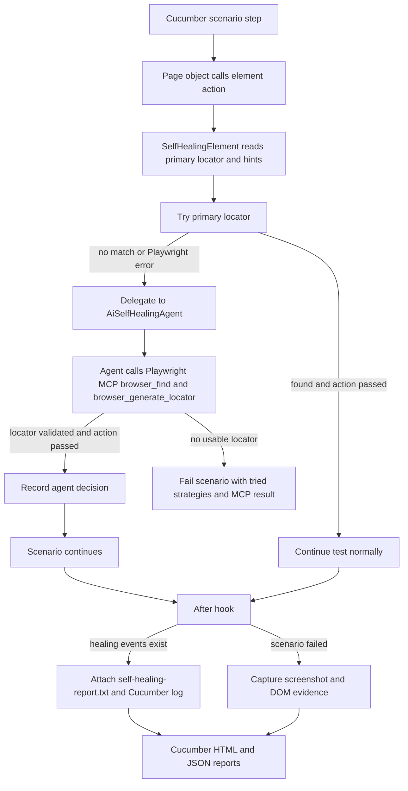
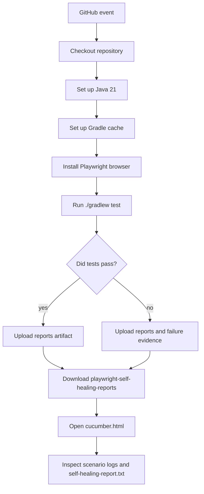

# playwright-mcp-usage

Java + Gradle + Cucumber + Playwright demo automation framework using the
page-object pattern, primary locators, an AI self-healing agent, and the
official Playwright MCP server for runtime locator healing.

## Demo Application

The included scenarios use the public Practice Test Automation login page:

`https://practicetestautomation.com/practice-test-login/`

Credentials used by the smoke scenario:

- Username: `student`
- Password: `Password123`

## Framework Layout

- `src/test/resources/features` - Cucumber feature files
- `src/test/java/com/example/playwright/steps` - Cucumber hooks and step definitions
- `src/test/java/com/example/playwright/pages` - page objects only; all web elements live here
- `src/test/java/com/example/playwright/healing` - AI self-healing agent, Playwright MCP client, locator conversion, and healing report support
- `src/test/java/com/example/playwright/core` - Playwright driver lifecycle and evidence capture
- `src/test/java/com/example/playwright/config` - runtime configuration
- `.github/workflows/playwright-self-healing-tests.yml` - GitHub Actions pipeline

## Self-Healing Approach

Each page object element is defined as an `ElementDefinition` with one primary
locator and optional intent hints. If the primary locator fails, the framework
delegates the failure to `AiSelfHealingAgent`. The agent starts the official
Playwright MCP server with `npx @playwright/mcp@latest`, asks MCP to find the
target element, asks `browser_generate_locator` for a stable locator, converts
that locator to Playwright Java, and returns a healing decision for retry.

Example from `LoginPage`:

```java
private static final ElementDefinition SUBMIT = new ElementDefinition(
        "login submit button",
        new LocatorStrategy("button#submit", page -> page.locator("button#submit")),
        "Submit"
);
```

If `button#submit` stops matching but the submit button is still recognizable on
the page, Playwright MCP can generate `getByRole('button', { name: 'Submit' })`,
and the Java test retries the click with `page.getByRole(...)`. Page objects do
not define secondary selectors.

## Flow Diagrams

- Current AI-agent flow: [playwright-mcp-ai-agent-healing-flow.svg](playwright-mcp-ai-agent-healing-flow.svg)
- Previous direct-MCP flow: [playwright-mcp-direct-healing-flow.svg](playwright-mcp-direct-healing-flow.svg)



## What Gets Reported

When a Playwright MCP selector succeeds, the Cucumber report includes the healing
details on the scenario where the healing happened.

The framework writes the details in two places:

- A visible Cucumber log entry in `cucumber.html`
- A `self-healing-report.txt` scenario attachment

Example report content:

```text
Self-healing locator events

Event 1
Element: login submit button
Healed by: AI agent selected Playwright MCP getByRole('button', { name: 'Submit' }) target=e42
Skipped strategies:
- button#submit (no matches)
Agent reasoning:
The agent used Playwright MCP browser_find to identify the element reference,
then browser_generate_locator to create a stable Playwright locator.
```

If multiple scenarios use the same healed element, each affected scenario gets
its own report attachment. Scenarios with no healing do not get a
`self-healing-report.txt` attachment.

## AI Agent With Playwright MCP

The healing path uses the official Playwright MCP server over Streamable HTTP:

```text
Java test -> failed primary locator -> AiSelfHealingAgent -> Playwright MCP -> agent decision -> Java retry
```

Recovery is managed by `AiSelfHealingAgent`:

- The agent receives the logical element name, intent hints, current page URL,
  and failed primary locator.
- The agent uses Playwright MCP `browser_find` to identify the target element in
  the accessibility snapshot.
- The agent uses Playwright MCP `browser_generate_locator` to generate a stable
  locator expression.
- The agent validates that the locator can be converted to Playwright Java.
- `SelfHealingElement` retries the original action with the agent-selected
  locator.

If MCP cannot find a matching element or returns a locator expression that this
Java framework cannot convert, the scenario fails with the tried primary locator
and MCP context.

## MCP With and Without an AI Agent

Playwright MCP can be used without an agent:

```text
Locator fails -> Java calls Playwright MCP -> MCP generates locator -> Java retries action
```

That is enough when the element is still recognizable through normal browser
signals such as role, accessible name, label, placeholder, text, id, or nearby
snapshot context.

This repo now uses an agent to own that recovery flow. The agent is useful
because it centralizes the decisions around locator repair:

- Understand changed UI intent, such as treating "Sign in" as the replacement
  for an old "Submit" button.
- Choose safely between multiple similar candidates on the page.
- Decide when not to heal because the product flow changed or the page is wrong.
- Explain whether the failure was locator drift, navigation timing, missing
  data, access control, or a real application defect.
- Update source code automatically, for example replacing the broken primary
  locator in a page object and opening a pull request.

In short:

```text
Playwright MCP = browser/page inspection and locator generation
AI agent = healing workflow, validation, safety decisions, explanation, and optional code repair
```

The current project uses an in-framework AI self-healing agent that manages
Playwright MCP and reports its decision. A model-backed agent can be added later
if the framework should reason about larger UI intent changes or commit locator
fixes back to the codebase.

## Local Usage

Install browser binaries once:

```bash
./gradlew installPlaywrightBrowsers
```

Run the Cucumber tests:

```bash
./gradlew test
```

Useful runtime options:

```bash
HEADLESS=false ./gradlew test
BASE_URL=https://practicetestautomation.com ./gradlew test
./gradlew test -Dcucumber.filter.tags="@smoke"
```

Reports are written to:

- `build/reports/tests/test/index.html`
- `build/reports/cucumber/cucumber.html`
- `build/reports/cucumber/cucumber.json`

Failure evidence is written to:

- `build/evidence`

## Local Demo: Force a Healing Event

To see the healing report locally, temporarily break the submit locator:

```java
new LocatorStrategy("button#submit-broken-for-healing-demo",
        page -> page.locator("button#submit-broken-for-healing-demo")),
```

Run:

```bash
./gradlew test
```

Expected behavior:

- The first submit locator has no matches.
- The framework uses a generated `AI agent selected Playwright MCP ...` locator.
- The scenario passes.
- `cucumber.html` shows `Self-healing locator events`.
- The scenario has a `self-healing-report.txt` attachment.

## GitHub Actions Pipeline

The workflow is defined at:

`.github/workflows/playwright-self-healing-tests.yml`

It runs on:

- push to `main` or `master`
- pull requests
- manual `workflow_dispatch`

Pipeline flow:



The workflow uploads this artifact:

`playwright-self-healing-reports`

Artifact contents:

- `build/reports/cucumber/cucumber.html`
- `build/reports/cucumber/cucumber.json`
- `build/reports/tests/test`
- `build/evidence`

The Playwright MCP healing report does not require an AI API key. The framework
starts the official MCP server through `npx` during the test run.

## How We Achieved Self-Healing in This Framework

1. Page objects define logical elements with one primary locator and intent
   hints.
2. `SelfHealingElement` tries the primary locator for every action.
3. When the primary locator has no matches or throws a Playwright error, it is recorded
   as skipped.
4. `AiSelfHealingAgent` calls the official Playwright MCP server and requests a
   generated locator with `browser_generate_locator`.
5. When the agent-selected locator works, `HealingReport.recordAgentHealing(...)` stores
   the element name, healed strategy, and skipped strategies for the current
   thread.
6. The Cucumber `@After` hook checks whether the current scenario has healing
   events.
7. If healing happened, the hook writes a visible scenario log and attaches
   `self-healing-report.txt`.
8. If MCP does not produce a usable locator, the scenario fails with the primary
   locator and MCP context.
9. Locally and in GitHub Actions, the same Gradle test command generates the
   Cucumber HTML/JSON reports.

## What Should Be Auto-Healed and What Should Not

Self-healing is useful for:

- button text changed slightly
- ID changed
- CSS class changed
- DOM hierarchy changed
- placeholder changed
- label changed slightly
- element moved to another container

Self-healing should not blindly fix:

- business flow changed
- wrong page loaded
- security or permission issue
- element removed intentionally
- validation message changed due to requirement change
- payment, finance, or legal workflow behavior changed

For example, if a "Submit Payment" button disappears, the framework should not
randomly click another button. That could hide a real defect.
