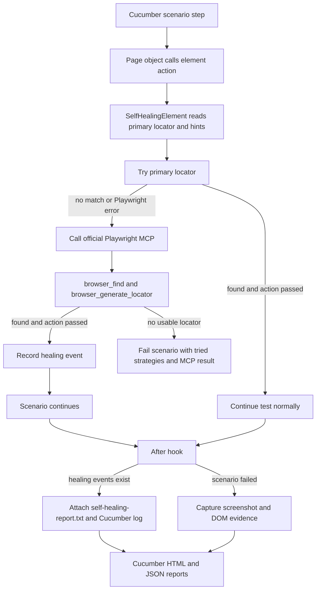
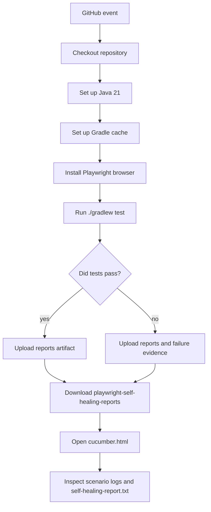

# playwright-mcp-usage

Java + Gradle + Cucumber + Playwright demo automation framework using the
page-object pattern, primary locators, and the official Playwright MCP server
for runtime locator healing.

## Demo Application

The included scenarios use the public Practice Test Automation login page:

`https://practicetestautomation.com/practice-test-login/`

Credentials used by the smoke scenario:

- Username: `student`
- Password: `Password123`

## Framework Layout

- `src/test/resources/features` - Cucumber feature files
- `src/test/java/com/example/playwright/steps` - Cucumber hooks and step definitions
- `src/test/java/com/example/playwright/pages` - page objects only; all web elements live here
- `src/test/java/com/example/playwright/healing` - Playwright MCP client, locator conversion, and healing report support
- `src/test/java/com/example/playwright/core` - Playwright driver lifecycle and evidence capture
- `src/test/java/com/example/playwright/config` - runtime configuration
- `.github/workflows/playwright-self-healing-tests.yml` - GitHub Actions pipeline

## Self-Healing Approach

Each page object element is defined as an `ElementDefinition` with one primary
locator and optional intent hints. If the primary locator fails, the framework
starts the official Playwright MCP server with `npx @playwright/mcp@latest`,
asks MCP to find the target element, asks `browser_generate_locator` for a
stable locator, converts that locator to Playwright Java, and retries the action.

Example from `LoginPage`:

```java
private static final ElementDefinition SUBMIT = new ElementDefinition(
        "login submit button",
        new LocatorStrategy("button#submit", page -> page.locator("button#submit")),
        "Submit"
);
```

If `button#submit` stops matching but the submit button is still recognizable on
the page, Playwright MCP can generate `getByRole('button', { name: 'Submit' })`,
and the Java test retries the click with `page.getByRole(...)`. Page objects do
not define secondary selectors.

## Flow Diagram

SVG version: [playwright-mcp-healing-flow.svg](playwright-mcp-healing-flow.svg)



## What Gets Reported

When a Playwright MCP selector succeeds, the Cucumber report includes the healing
details on the scenario where the healing happened.

The framework writes the details in two places:

- A visible Cucumber log entry in `cucumber.html`
- A `self-healing-report.txt` scenario attachment

Example report content:

```text
Self-healing locator events

Event 1
Element: login submit button
Healed by: Playwright MCP getByRole('button', { name: 'Submit' }) target=e42
Skipped strategies:
- button#submit (no matches)
```

If multiple scenarios use the same healed element, each affected scenario gets
its own report attachment. Scenarios with no healing do not get a
`self-healing-report.txt` attachment.

## Playwright MCP Locator Agent

The healing path uses the official Playwright MCP server over Streamable HTTP:

```text
Java test -> failed primary locator -> npx @playwright/mcp@latest -> browser_find -> browser_generate_locator -> Java retry
```

Recovery is handled through Playwright MCP:

- Playwright MCP locator discovery: if the primary locator fails, MCP generates
  a stable locator from the accessibility snapshot.

If MCP cannot find a matching element or returns a locator expression that this
Java framework cannot convert, the scenario fails with the tried primary locator
and MCP context.

## Local Usage

Install browser binaries once:

```bash
./gradlew installPlaywrightBrowsers
```

Run the Cucumber tests:

```bash
./gradlew test
```

Useful runtime options:

```bash
HEADLESS=false ./gradlew test
BASE_URL=https://practicetestautomation.com ./gradlew test
./gradlew test -Dcucumber.filter.tags="@smoke"
```

Reports are written to:

- `build/reports/tests/test/index.html`
- `build/reports/cucumber/cucumber.html`
- `build/reports/cucumber/cucumber.json`

Failure evidence is written to:

- `build/evidence`

## Local Demo: Force a Healing Event

To see the healing report locally, temporarily break the submit locator:

```java
new LocatorStrategy("button#submit-broken-for-healing-demo",
        page -> page.locator("button#submit-broken-for-healing-demo")),
```

Run:

```bash
./gradlew test
```

Expected behavior:

- The first submit locator has no matches.
- The framework uses a generated `Playwright MCP ...` locator.
- The scenario passes.
- `cucumber.html` shows `Self-healing locator events`.
- The scenario has a `self-healing-report.txt` attachment.

## GitHub Actions Pipeline

The workflow is defined at:

`.github/workflows/playwright-self-healing-tests.yml`

It runs on:

- push to `main` or `master`
- pull requests
- manual `workflow_dispatch`

Pipeline flow:



The workflow uploads this artifact:

`playwright-self-healing-reports`

Artifact contents:

- `build/reports/cucumber/cucumber.html`
- `build/reports/cucumber/cucumber.json`
- `build/reports/tests/test`
- `build/evidence`

The Playwright MCP healing report does not require an AI API key. The framework
starts the official MCP server through `npx` during the test run.

## How We Achieved Self-Healing in This Framework

1. Page objects define logical elements with one primary locator and intent
   hints.
2. `SelfHealingElement` tries the primary locator for every action.
3. When the primary locator has no matches or throws a Playwright error, it is recorded
   as skipped.
4. `McpLocatorAgent` calls the official Playwright MCP server and requests a
   generated locator with `browser_generate_locator`.
5. When a generated locator works, `HealingReport.recordAgentHealing(...)` stores
   the element name, healed strategy, and skipped strategies for the current
   thread.
6. The Cucumber `@After` hook checks whether the current scenario has healing
   events.
7. If healing happened, the hook writes a visible scenario log and attaches
   `self-healing-report.txt`.
8. If MCP does not produce a usable locator, the scenario fails with the primary
   locator and MCP context.
9. Locally and in GitHub Actions, the same Gradle test command generates the
   Cucumber HTML/JSON reports.

## What Should Be Auto-Healed and What Should Not

Self-healing is useful for:

- button text changed slightly
- ID changed
- CSS class changed
- DOM hierarchy changed
- placeholder changed
- label changed slightly
- element moved to another container

Self-healing should not blindly fix:

- business flow changed
- wrong page loaded
- security or permission issue
- element removed intentionally
- validation message changed due to requirement change
- payment, finance, or legal workflow behavior changed

For example, if a "Submit Payment" button disappears, the framework should not
randomly click another button. That could hide a real defect.
