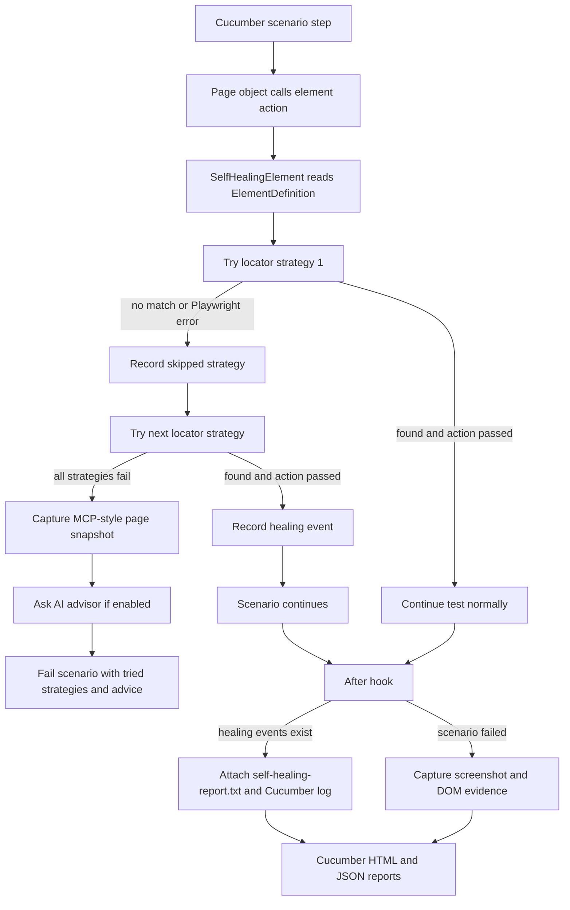
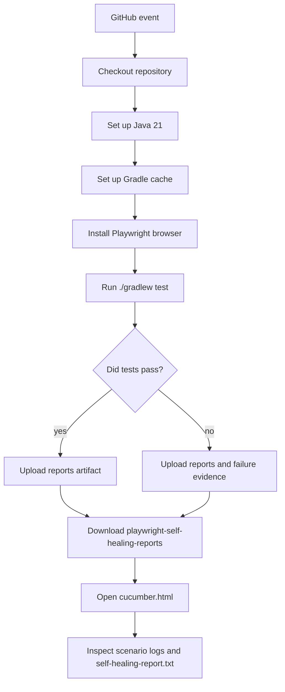

# playwright-mcp-usage

Java + Gradle + Cucumber + Playwright demo automation framework using the
page-object pattern, deterministic self-healing locators, and optional AI/MCP
style locator-healing advice.

## Demo Application

The included scenarios use the public Practice Test Automation login page:

`https://practicetestautomation.com/practice-test-login/`

Credentials used by the smoke scenario:

- Username: `student`
- Password: `Password123`

## Framework Layout

- `src/test/resources/features` - Cucumber feature files
- `src/test/java/com/example/playwright/steps` - Cucumber hooks and step definitions
- `src/test/java/com/example/playwright/pages` - page objects only; all web elements live here
- `src/test/java/com/example/playwright/healing` - self-healing locator and AI/MCP snapshot support
- `src/test/java/com/example/playwright/core` - Playwright driver lifecycle and evidence capture
- `src/test/java/com/example/playwright/config` - runtime configuration
- `.github/workflows/playwright-self-healing-tests.yml` - GitHub Actions pipeline

## Self-Healing Approach

Each page object element is defined as an `ElementDefinition` with multiple
locator strategies, ordered from most specific to most semantic. The framework
tries each strategy in order until one resolves an element and the Playwright
action succeeds.

Example from `LoginPage`:

```java
private static final ElementDefinition SUBMIT = new ElementDefinition("login submit button", List.of(
        new LocatorStrategy("button#submit", page -> page.locator("button#submit")),
        new LocatorStrategy("role button Submit", page -> page.getByRole(AriaRole.BUTTON,
                new Page.GetByRoleOptions().setName("Submit"))),
        new LocatorStrategy("button text Submit", page -> page.locator("button").filter(
                new LocatorFilterOptions("Submit").toOptions()))
));
```

If `button#submit` stops matching but the submit button is still available by
role/name, the test continues using `role button Submit`. That is the runtime
self-healing behavior.

## Flow Diagram



## What Gets Reported

When a fallback selector succeeds, the Cucumber report includes the healing
details on the scenario where the healing happened.

The framework writes the details in two places:

- A visible Cucumber log entry in `cucumber.html`
- A `self-healing-report.txt` scenario attachment

Example report content:

```text
Self-healing locator events

Event 1
Element: login submit button
Healed by: role button Submit
Skipped strategies:
- button#submit (no matches)
```

If multiple scenarios use the same healed element, each affected scenario gets
its own report attachment. Scenarios with no healing do not get a
`self-healing-report.txt` attachment.

## MCP-Style Snapshot and AI Advice

This project does not use an external MCP SDK or MCP library. The MCP-style
part is implemented with custom Java code in `McpPageSnapshot`, using Playwright
to collect structured page context.

There are two levels of recovery:

- Deterministic fallback healing: tries the locator strategies already defined
  in the page object. This is what lets a test pass when a later locator works.
- MCP-style AI advice: used only after every locator strategy fails.

On final failure, the framework captures an MCP-style page snapshot containing:

- current URL and title
- visible page text
- discovered interactive elements and useful attributes

If AI healing is enabled and `OPENAI_API_KEY` is present, the snapshot is sent
to the configured AI endpoint. The AI response is included in the assertion
failure to help repair the page object. The AI path does not automatically edit
source code.

## Local Usage

Install browser binaries once:

```bash
./gradlew installPlaywrightBrowsers
```

Run the Cucumber tests:

```bash
./gradlew test
```

Run with AI/MCP advice enabled:

```bash
AI_HEALING_ENABLED=true OPENAI_API_KEY=... ./gradlew test
```

Useful runtime options:

```bash
HEADLESS=false ./gradlew test
BASE_URL=https://practicetestautomation.com ./gradlew test
./gradlew test -Dcucumber.filter.tags="@smoke"
```

Reports are written to:

- `build/reports/tests/test/index.html`
- `build/reports/cucumber/cucumber.html`
- `build/reports/cucumber/cucumber.json`

Failure evidence is written to:

- `build/evidence`

## Local Demo: Force a Healing Event

To see the healing report locally, temporarily break the first submit locator
while leaving the fallback locators valid:

```java
new LocatorStrategy("button#submit-broken-for-healing-demo",
        page -> page.locator("button#submit-broken-for-healing-demo")),
new LocatorStrategy("role button Submit", page -> page.getByRole(AriaRole.BUTTON,
        new Page.GetByRoleOptions().setName("Submit"))),
```

Run:

```bash
AI_HEALING_ENABLED=true ./gradlew test
```

Expected behavior:

- The first submit locator has no matches.
- The framework uses `role button Submit`.
- The scenario passes.
- `cucumber.html` shows `Self-healing locator events`.
- The scenario has a `self-healing-report.txt` attachment.

## GitHub Actions Pipeline

The workflow is defined at:

`.github/workflows/playwright-self-healing-tests.yml`

It runs on:

- push to `main` or `master`
- pull requests
- manual `workflow_dispatch`

Pipeline flow:



The workflow uploads this artifact:

`playwright-self-healing-reports`

Artifact contents:

- `build/reports/cucumber/cucumber.html`
- `build/reports/cucumber/cucumber.json`
- `build/reports/tests/test`
- `build/evidence`

To enable AI/MCP advice in GitHub Actions, create a repository secret:

`OPENAI_API_KEY`

The deterministic fallback healing report works without this secret. The secret
is only needed when all locators fail and the framework asks the AI advisor for
repair guidance.

## How We Achieved Self-Healing in This Framework

1. Page objects define logical elements with multiple locator strategies.
2. `SelfHealingElement` tries those strategies in order for every action.
3. When a strategy has no matches or throws a Playwright error, it is recorded
   as skipped.
4. When a later strategy works, `HealingReport.recordFallback(...)` stores the
   element name, healed strategy, and skipped strategies for the current thread.
5. The Cucumber `@After` hook checks whether the current scenario has healing
   events.
6. If healing happened, the hook writes a visible scenario log and attaches
   `self-healing-report.txt`.
7. If all strategies fail, the framework captures an MCP-style page snapshot and
   includes optional AI advice in the assertion failure.
8. Locally and in GitHub Actions, the same Gradle test command generates the
   Cucumber HTML/JSON reports.

## What Should Be Auto-Healed and What Should Not

Self-healing is useful for:

- button text changed slightly
- ID changed
- CSS class changed
- DOM hierarchy changed
- placeholder changed
- label changed slightly
- element moved to another container

Self-healing should not blindly fix:

- business flow changed
- wrong page loaded
- security or permission issue
- element removed intentionally
- validation message changed due to requirement change
- payment, finance, or legal workflow behavior changed

For example, if a "Submit Payment" button disappears, the framework should not
randomly click another button. That could hide a real defect.
